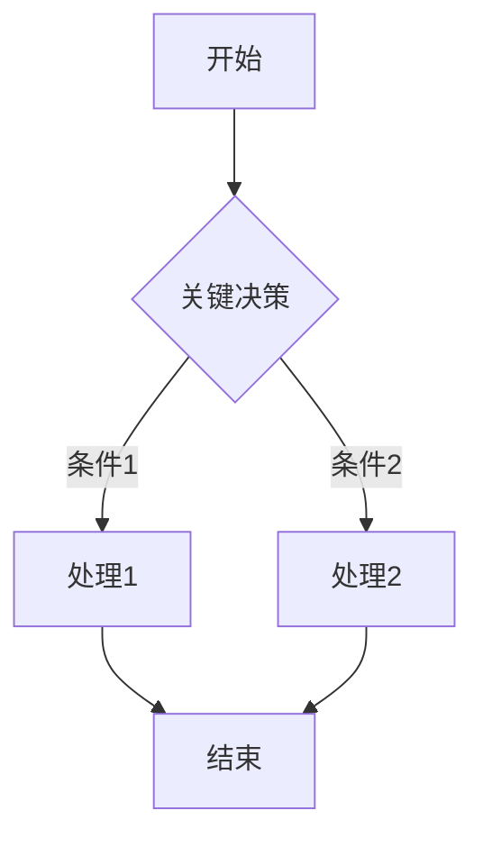
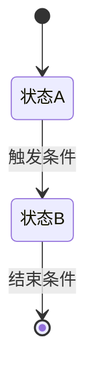

当用户输入 `/pg:analyze` 命令时，你必须严格按照以下步骤执行：

---

## 第一步：解析分析来源

识别用户提供的分析材料（可多种同时存在）：

| 来源类型 | 处理方式 |
|---|---|
| 代码目录路径 | `list_dir` + `view_file` 扫描 |
| Confluence 页面链接 | `confluence_get_page` 读取，含图片则追加 `confluence_get_page_images` |
| 旧版设计文档文本 | 直接分析用户粘贴内容 |
| 核心文件列表 | 逐文件 `view_file` 读取 |
| 口头描述 | 基于文字描述构建结构 |

**⚠️ 若用户仅输入 `/pg:analyze`，输出以下提示并等待：**

请提供分析材料（任意一种或多种）：

1. **代码目录路径**（如：`src/main/java/com/example/`）
2. **Confluence 页面链接**（已有的系统设计文档）
3. **旧版设计文档**（直接粘贴）
4. **关键文件列表**（重点分析的文件）
5. **口头描述**（文字说明现有系统情况）

同时请告知：
- **系统名称**（如：商品中心、订单服务）
- **分析重点**（可选）：即将新增的需求方向，便于聚焦关键模块

---

## 第二步：扫描与读取内容

### 代码目录扫描（若提供路径）

1. `list_dir` 扫描根目录，了解整体结构
2. 重点扫描：`controller/` `service/` `domain/` `model/` `config/` `mapper/` `repository/`
3. 优先读取：
   - `*Application.java`（主类、包结构）
   - `*Config.java`（关键开关与配置）
   - 核心 Service 类（业务逻辑边界）
   - 核心 DO/DTO 定义（数据模型）
   - Mapper/SQL（数据访问逻辑）
4. 识别技术债信号：
   - 硬编码、魔法值、`TODO/FIXME/HACK` 注释
   - 临时绕过方案、重复逻辑、脆弱依赖

---

## 第三步：分析整理（不输出，仅内部归纳）

提取以下信息供写文件使用：
- 架构层次（Controller/Service/Mapper 分层）
- 模块划分与职责边界
- 核心数据模型与关系
- 对外接口清单
- 核心业务流程与状态机
- 技术栈版本（JDK、框架、中间件）
- 设计模式应用
- 技术债与历史包袱
- 术语命名规范

---

## 第四步：按模板写入「现状程序设计文档」

> ⚡ **直接写文件，不在回复中输出完整文档**。以下模板是写入文件的格式规范，按此结构填充真实分析内容后立即写入。

**文件命名**：`现状设计_[系统名称]_YYYYMMDD.md`

---

> 📌 以下为**写入文件的内容格式**（不输出到回复，仅作为写文件时的章节规范）

```markdown
# [系统名称] 现状程序设计文档

> 分析时间：[当前日期]
> 分析范围：[描述了哪些材料/文件]
> 文档用途：作为新需求开发时的「已有系统参考」，供 /pg:plan 使用

---

## 1. 模块概述

**业务定位**：模块在整个系统中的角色和价值（1-2句）

**核心目标**：
- [解决的核心业务问题1]
- [核心业务问题2]
- [核心业务问题3]

**边界范围**：
- ✅ 负责：[模块职责]
- ❌ 不负责：[明确排除的职责]

**依赖关系**：
| 方向 | 系统/模块 | 依赖内容 |
|---|---|---|
| 上游（调用方） | [系统名] | [调用的接口] |
| 下游（被依赖） | [系统名] | [被调用的服务] |

**技术栈**：
| 技术 | 版本/说明 |
|---|---|
| 语言 | Java 11 |
| 框架 | Spring Boot 2.x |
| ORM | MyBatis |
| 配置中心 | Apollo |
| 消息队列 | [如有] |
| 缓存 | [Redis 版本] |

---

## 2. 业务需求分析

**核心功能清单**：

| 功能 | 描述 | 用户故事 | 验收标准 |
|---|---|---|---|
| [功能名] | [1句话] | As a...I want...So that... | [可测试条件] |

**核心数据模型**：

| 实体名 | 业务含义 | 关键字段 | 约束条件 | 索引设计 |
|---|---|---|---|---|
| [表名] | [业务含义] | [关键字段列表] | [唯一键/非空等] | [索引字段] |

**核心业务规则**：
- [规则1：如价格计算逻辑]
- [规则2：如库存扣减约束]

---

## 3. 核心业务逻辑设计

**主业务流程**：



**状态流转**（如有状态机）：



**核心算法/关键逻辑**：
- [逻辑名称]：[具体描述计算规则]

**异常处理策略**：
| 异常场景 | 处理方式 | 响应给调用方 |
|---|---|---|
| [场景] | [处理策略] | [返回内容] |

**并发控制**：
- [如：乐观锁/悲观锁/分布式锁的使用场景]

---

## 4. 系统架构设计

**分层结构**：

```
src/main/java/com/example/
├── controller/      ← 接口层，参数校验和转发
├── service/         ← 业务逻辑，核心处理
│   └── impl/        ← Service 实现类
├── domain/          ← 领域对象（DO/DTO/VO）
├── mapper/          ← 数据访问层
└── config/          ← 配置类
```

**设计模式应用**：
| 模式 | 应用位置 | 解决的问题 |
|---|---|---|
| [策略模式] | [XxxStrategy.java] | [扩展不同业务策略] |

**关键 API 设计**：
| 接口路径 | 方法 | 请求参数 | 响应结构 | 说明 |
|---|---|---|---|---|
| `/api/xxx` | POST | [关键字段] | [关键字段] | [功能描述] |

---

## 5. 关键代码实现

**核心服务逻辑片段**（20-50行，含业务含义注释）：

```java
// [说明这段代码解决的核心业务问题]
public class XxxServiceImpl implements XxxService {
    // ...核心实现，突出关键逻辑...
}
```

**事务边界说明**：
- [方法名]：事务范围 [描述]，异常时 [回滚策略]

**性能关键点**：
- [如：批量查询替代 N+1，Redis 缓存降低 DB 压力]

---

## 6. 数据设计

**主要表结构**：

| 字段名 | 类型 | 是否必填 | 说明 |
|---|---|---|---|
| id | bigint | 是 | 主键，自增 |
| [字段] | [类型] | [是/否] | [业务含义] |

**索引策略**：
| 索引名 | 字段 | 类型 | 用途 |
|---|---|---|---|
| idx_xxx | [字段] | 普通/唯一 | [查询场景] |

**数据一致性**：
- [如：跨表事务使用 @Transactional，范围：XXX]

---

## 7. 集成与接口

**外部依赖**：
| 系统 | 调用方式 | 超时设置 | 容错机制 |
|---|---|---|---|
| [系统名] | HTTP/RPC | [Xms] | [降级/重试] |

**消息队列**（如有）：
| Topic | 生产/消费 | 触发条件 | 消费逻辑 |
|---|---|---|---|

**缓存策略**：
| 缓存Key | 更新时机 | 失效时间 | 失效策略 |
|---|---|---|---|

**监控埋点**：
- [关键业务指标：如下单量、转化率]
- [技术指标：如 P99 响应时间、错误率]

---

## 8. 测试策略

**单元测试重点**：
- [XxxService.doCreate()：覆盖正常/库存不足/用户不存在等场景]

**集成测试场景**：
- [端到端流程：[描述完整业务场景]]

**性能基准**：
- 目标 QPS：[N]，P99 响应时间：[Xms]

---

## 9. 部署运维

**环境要求**：
| 组件 | 版本要求 |
|---|---|
| JDK | 11+ |
| MySQL | 5.7+ |
| Redis | 6.x |

**关键配置项**（Apollo/application.yml）：
```yaml
# [配置组] — [说明]
xxx:
  enabled: true       # 功能开关
  timeout: 3000       # 超时时间（ms）
```

**常见故障处理**：
| 现象 | 可能原因 | 处理方式 |
|---|---|---|
| [现象] | [原因] | [处理步骤] |

---

## 10. ⚠️ 技术债与历史包袱

| 位置 | 问题描述 | 风险等级 | 影响新需求的方式 |
|---|---|---|---|
| [XxxService.java:L123] | [硬编码了 categoryId=1] | 高/中/低 | [新增品类时需绕过] |

**新需求开发约束**：
1. **禁止修改**：[哪些代码/接口不能改，原因]
2. **必须兼容**：[哪些历史逻辑需向前兼容]
3. **推荐做法**：[基于现有代码风格的建议写法]
4. **扩展点**：[已有的扩展机制可以直接利用]

---

## 11. 扩展性设计

**已有扩展点**：
| 扩展点 | 位置 | 接入方式 |
|---|---|---|
| [策略扩展] | [XxxStrategy 接口] | [实现接口并注册 Bean] |

**配置化能力**：
- [通过 Apollo 配置可以动态调整的行为]

**版本兼容说明**：
- [已有接口的兼容边界，哪些字段为历史冗余]
```

---

## 第五步：确定目录、写文件并输出摘要

1. **确定存储目录**（按优先级）：
   - 已有 `spec-status.json` → 使用其中的 `specDir`
   - 当前有活跃项目工作区 → `[项目根]/pg/doc/`
   - 否则 → 询问用户指定目录

2. **立即写入文件**，写完后在回复中仅输出**摘要**，不重复文档内容：

---

✅ **现状程序设计文档已写入：`[文件路径]`**

━━━━━━━━━━━━━━━━━━━━━━━━━━━━━━━━━━
🏛  系统：[系统名称]
📍 已完成：遗留系统梳理（共 11 章）
📁 文档：`[文件路径]`
━━━━━━━━━━━━━━━━━━━━━━━━━━━━━━━━━━

**核心结论速览**：
- 🏗 架构：[一句话描述分层和核心模式]
- 🔑 关键业务逻辑：[最核心的 1-2 个点]
- 📦 外部依赖：[依赖的主要外部系统]

⚠️ **高风险技术债**（共 [N] 项，仅列高/中级）：
| 位置 | 问题 | 风险等级 |
|---|---|---|
| [位置] | [问题描述] | 高/中 |

⏭ **建议下一步**：
1. `/pg:spec [需求名称]` 初始化新需求
2. `/pg:prd [需求来源]` 生成需求文档
3. `/pg:plan` 时直接引用本文档作为「已有系统参考」

---

## 禁止行为

- ❌ 禁止修改或重构任何现有代码（只分析，不改动）
- ❌ 禁止虚构功能（所有描述必须基于实际代码事实）
- ❌ 禁止省略技术债章节（即使代码质量很好，也需标注「暂无明显技术债」）
- ❌ 禁止美化历史设计（如实反映，帮助用户对包袱心中有数）
- ❌ **禁止在回复中输出完整文档内容**（只写文件 + 输出摘要，不重复展示）
