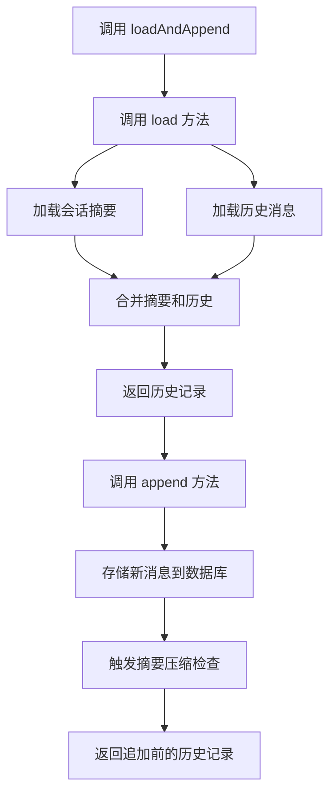
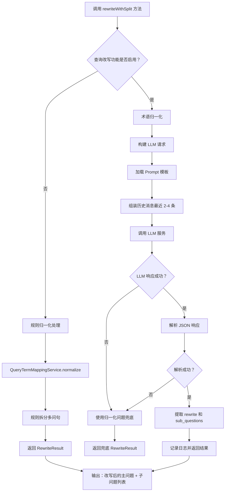
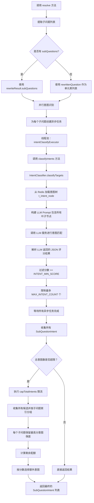
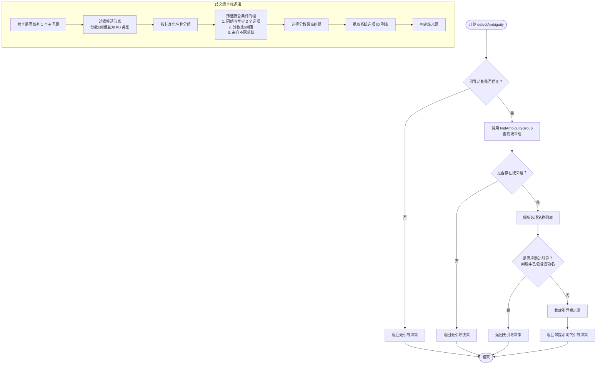

### 接口
com.nageoffer.ai.ragent.rag.controller.RAGChatController.chat: /rag/v3/chat

### 流程
用户问题 -> 记忆加载 -> 问题改写与拆分 -> 意图识别 -> 歧义检测与引导 -> 纯系统意图处理 -> 执行检索 -> 聚合意图 -> 模型调用
```
┌─────────────────────────────────────────────────────────────────┐
│                    streamChat 主流程                            │
└────────────────────────┬────────────────────────────────────────┘
                         │
                         ▼
    ┌──────────────────────────────────────────────┐
    │ 1. 初始化阶段                                │
    │    - 生成/复用会话 ID                         │
    │    - 生成任务 ID（链路追踪）                  │
    │    - 创建事件回调处理器                       │
    └──────────────────┬───────────────────────────┘
                       │
                       ▼
    ┌──────────────────────────────────────────────┐
    │ 2. 加载对话历史                              │
    │    memoryService.loadAndAppend()             │
    │    - 从存储中加载历史消息                     │
    │    - 追加当前用户问题                         │
    └──────────────────┬───────────────────────────┘
                       │
                       ▼
    ┌──────────────────────────────────────────────┐
    │ 3. 查询改写 & 拆分                           │
    │    queryRewriteService.rewriteWithSplit()    │
    │    - 消除指代歧义                             │
    │    - 补充省略信息                             │
    │    - 拆分为多个子问题                         │
    └──────────────────┬───────────────────────────┘
                       │
                       ▼
    ┌──────────────────────────────────────────────┐
    │ 4. 意图识别                                  │
    │    intentResolver.resolve()                  │
    │    - 匹配预定义的业务节点                     │
    │    - 生成 SubQuestionIntent 列表              │
    └──────────────────┬───────────────────────────┘
                       │
                       ▼
    ┌──────────────────────────────────────────────┐
    │ 5. 歧义检测                                  │
    │    guidanceService.detectAmbiguity()         │
    │                                              │
    │    ┌─────────────────┐                      │
    │    │  存在歧义？     │──YES──► 返回引导话术  │
    │    └─────────────────┘                      │
    │              │NO                            │
    └──────────────┼──────────────────────────────┘
                   │
                   ▼
    ┌──────────────────────────────────────────────┐
    │ 6. 系统-only 意图判断                        │
    │    (无需知识库检索的固定回复)                 │
    │                                              │
    │    ┌─────────────────┐                      │
    │    │ 全部 SystemOnly?│──YES──► 直接调用 LLM │
    │    └─────────────────┘                      │
    │              │NO                            │
    └──────────────┼──────────────────────────────┘
                   │
                   ▼
    ┌──────────────────────────────────────────────┐
    │ 7. 执行检索                                  │
    │    retrievalEngine.retrieve()                │
    │    ├─ MCP 检索：外部工具/API调用              │
    │    └─ KB 检索：向量数据库检索                 │
    │                                              │
    │    ┌─────────────────┐                      │
    │    │   结果为空？    │──YES──► 返回无结果提示│
    │    └─────────────────┘                      │
    └──────────────┼──────────────────────────────┘
                   │
                   ▼
    ┌──────────────────────────────────────────────┐
    │ 8. 聚合意图                                  │
    │    intentResolver.mergeIntentGroup()         │
    │    - 合并相同类型的意图                       │
    │    - 规划检索结果用于 Prompt                  │
    └──────────────────┬───────────────────────────┘
                       │
                       ▼
    ┌──────────────────────────────────────────────┐
    │ 9. 构建 Prompt & 调用 LLM                    │
    │    streamLLMResponse()                       │
    │    - 组装系统 Prompt + 上下文 + 检索结果      │
    │    - 流式调用大模型                          │
    │    - 绑定取消句柄（支持中途停止）             │
    └──────────────────────────────────────────────┘

```

### 使用场景
| 场景 | 描述 | 示例 |
| --- | --- | --- |
| 智能客服 | 智能客服，基于知识库自动回答用户问题 | "如何重置密码？" |
| 企业助手 | 查询公司内部制度和流程 | "年假怎么计算？" |  
| 技术支持 | 结合 API 和文档诊断问题 | "订单同步失败怎么办？" |  
| 数据分析 | 调用 MCP 工具查询业务数据 | "上季度销售额是多少？" |  
| 多轮对话 | 支持多轮对话，支持上下文关联 | "北京天气怎么样？" → "上海呢？" |

### 记忆加载

#### 执行流程


#### 关键逻辑与基础设施
| 组件/逻辑 | 作用 | 涉及基础设施 | 说明 |
| --- | --- | --- | --- |
| load 方法 | 加载对话历史记录 | t_conversation_summary 表、t_message 表 | 并行加载摘要和历史消息，最多加载配置的轮数 × 2 条消息 |
| append 方法 | 追加新消息到对话历史 | t_message 表、t_conversation 表 | 插入新消息记录，更新会话的最后时间 |
| ConversationMemoryStore | 记忆存储接口 | JdbcConversationMemoryStore 实现 | 负责与数据库交互，管理消息的持久化 |
| ConversationMemorySummaryService | 摘要服务 | t_conversation_summary 表 | 管理对话摘要的生成、压缩和加载 |

####  应用场景示例
| 场景 | 解决的问题 | 具体应用 | 优势 |
| --- | --- | --- | --- |
| 智能问答流式对话 | 在多轮对话中保持上下文连贯性 | RAGChatServiceImpl.streamChat() 在第 93 行调用 | 一次性获取历史并保存当前问题，避免两次数据库调用，提升性能 |
| 对话上下文构建 | LLM 需要历史对话才能理解当前问题的指代和语境 | 将历史消息传递给 queryRewriteService 和 promptBuilder | 支持多轮对话中的指代消解、问题改写等功能 |
| 会话状态维护 | 记录用户的提问历史，方便后续追溯和分析 | 自动更新 t_conversation 和 t_message 表 | 无需手动管理会话状态，保证数据一致性 |
| 长对话压缩 | 当对话轮数过多时，避免超出 LLM 上下文窗口限制 | append 方法触发 compressIfNeeded 检查 | 自动生成对话摘要，在保留核心信息的前提下减少 token 消耗 |

### 查询改写拆分

#### 执行流程


#### 关键逻辑与基础设施
| 组件/逻辑 | 作用 | 涉及基础设施                      | 说明 |
| --- | --- |-----------------------------| --- |
| QueryTermMappingService | 术语归一化映射 | t_query_term_mapping,数据库配置表 | 将用户口语化表述映射为标准业务术语，如"登录不了"→"登录失败" |
| LLMService | 大语言模型调用 | OpenAI/DashScope 等 LLM API | 使用低温度参数 (0.1) 确保改写结果稳定可靠 |
| PromptTemplateLoader | Prompt 模板加载 | /prompt/user-question-rewrite.st 文件 | 提供改写指令、规则约束和示例 Few-shot |
| rewriteWithSplit（带历史） | 支持上下文的改写拆分 | ChatMessage 历史列表 | 结合对话历史解决指代消解问题，如"它的数据库"→"12306 系统的数据库" |

#### 应用场景示例
| 场景 | 解决的问题 | 具体应用 | 优势 |
| --- | --- | --- | --- |
| 多问句拆分检索 | 用户一次性提出多个问题，单一检索无法覆盖所有意图 | "12306 的订单流程是什么？支付环节怎么处理？"拆分成两个子问题分别检索 | 每个子问题独立检索知识库，提升召回准确率，避免遗漏关键信息 |
| 智能改写 | 智能改写，支持多轮对话中的指代消解 | 历史问过"12306 系统架构"，后续问"它的数据库用什么？"自动还原为"12306 系统的数据库" | 利用对话历史补全省略信息，确保检索查询语义完整 |
| 礼貌用语删除 | 用户问题的客套话干扰检索匹配 | "请帮我详细介绍一下 12306 系统的架构，谢谢"改写为"12306 系统的架构" | 去除无关词汇，提升向量检索和关键词匹配的精准度 |
| 专有名词保护 | 改写过程误改系统名、产品名导致检索偏差 | "OA 系统在移动端的审批流程"保持 OA、移动端等术语不变 | 确保业务系统名称、模块名准确匹配知识库文档 |
| 复杂问题分解 | 复合型问题需要多维度检索 | "微服务架构如何部署？监控怎么做？"拆分为部署和监控两个子问题 | 针对性检索不同知识领域，提升回答的结构化和完整性 |

### 意图识别

#### 执行流程

#### 关键逻辑与基础设施
| 组件/逻辑 | 作用 | 涉及基础设施 | 说明 |
| --- | --- | --- | --- |
| IntentClassifier | 意图识别核心分类器 | t_intent_node | 所有叶子分类节点做意图识别，输出每个分类的 score |
| PromptTemplateLoader | Prompt 模板加载 | /prompt/intent-classification.st 文件 | 提供意图识别指令、规则约束和示例 Few-shot |
| classifyIntents 方法 | 单个问题的意图分类 | - | 调用分类器后过滤低分意图（≥INTENT_MIN_SCORE），限制数量（≤MAX_INTENT_COUNT） |
| capTotalIntents 方法 | 意图总数限流 | - | 当总意图数超过 MAX_INTENT_COUNT 时，采用保底 + 择优策略分配配额 |
| LLMService | 大语言模型调用 | - | 基于 Prompt 对所有叶子节点进行打分，使用低温度参数 (0.1) 确保稳定性 |

#### 应用场景示例
| 场景 | 解决的问题 | 具体应用 | 优势 |
| --- | --- | --- | --- |
| 多问句意图识别 | 用户一次性提出多个问题，需要分别识别每个问题的意图 | "12306 的订单流程是什么？支付环节怎么处理？"拆分为两个子问题并行识别 | 通过线程池并发处理，避免串行延迟，每个子问题独立获得最匹配的意图 |
| 意图冲突消解 | 多个子问题的意图总数超过系统处理上限 | 5 个子问题各识别出 3 个意图（共 15 个），超过 MAX_INTENT_COUNT=10 | 采用保底策略：每个子问题至少保留 1 个最高分意图，剩余配额按全局分数分配 |
| 知识库 vs 工具路由 | 用户问题可能同时涉及知识库查询和 MCP 工具调用 | "帮我查一下 OA 系统的请假流程，顺便提交一个请假申请"→KB 意图（流程文档）+MCP 意图（提交申请工具） | 通过 mergeIntentGroup 分离两种意图，分别走知识库检索和工具调用两条路径 |

### 歧义检测

#### 执行流程

#### 关键逻辑与基础设施
| 组件/逻辑 | 作用 | 涉及基础设施 | 说明 |
| --- | --- | --- | --- |
| findAmbiguityGroup | 歧义组查找 | t_intent_node (意图节点表) | 从子问题的意图候选中找出可能存在歧义的节点组，要求：①同组内至少 2 个选项 ②分数相近（次高分/最高分≥0.8）③来自不同系统 |
| filterCandidates | 候选节点过滤 | - | 过滤出分数≥INTENT_MIN_SCORE 且为知识库类型的节点 |
| normalizeName | 名称标准化 | - | 将名称转为小写并移除标点和空格，用于归一化匹配（如"人事部门"和"人事 部门"视为相同） |
| passScoreRatio | 分数比例校验 | - | 检查次高分与最高分的比值是否达到阈值，判断是否存在真正的歧义 |
| hasMultipleSystems | 多系统校验 | t_intent_node | 确保歧义组内的选项来自不同的系统/分类，避免同一系统内的重复 |
| buildPrompt | 构建引导提示词 | guidance_prompt.txt (提示词模板文件) | 使用模板渲染引导语，包含歧义主题和待选选项列表 |

#### 应用场景示例
| 场景 | 解决的问题 | 具体应用 | 优势 |
| --- | --- | --- | --- |
| 模糊问题引导<br>用户问："请假流程" | 用户未指明具体系统，可能涉及多个相关系统 | 检测到"人事系统 - 请假流程"和"OA 系统 - 请假审批"两个意图分数相近，生成引导：<br>"您想咨询的是：<br>1) 人事系统的员工请假流程<br>2) OA 系统的请假审批流程" | 避免猜错意图，让用户明确选择，提升答案准确性 |
| 跨系统歧义处理<br>用户问："报销标准" | 财务系统和差旅系统都有报销相关政策 | 识别到"财务部 - 报销制度"和"差旅管理 - 报销标准"来自不同系统且分数接近，触发引导确认 | 防止混淆不同部门的政策，确保回答来源准确 |

### 执行检索
#### 核心架构
```
┌─────────────────────────────────────────────────────────────────┐
│                    MultiChannelRetrievalEngine                  │
└───────────────────┬─────────────────────────────────────────────┘
                    │
        ┌───────────┴───────────┐
        │                       │
        ▼                       ▼
┌──────────────┐        ┌──────────────┐
│ SearchChannel│        │SearchChannel │
│ (检索通道)   │        │ (检索通道)   │
├──────────────┤        ├──────────────┤
│ 1. Intent    │        │ 2. Vector    │
│  Directed    │        │  Global      │
│ (意图定向)   │        │ (向量全局)   │
└──────┬───────┘        └──────┬───────┘
       │                      │
       └──────────┬───────────┘
                  │
                  ▼
        ┌─────────────────┐
        │ 合并所有通道的结果 │
        └────────┬────────┘
                 │
                 ▼
        ┌─────────────────┐
        │ PostProcessor   │
        │ (后置处理器链)  │
        ├─────────────────┤
        │ 1. Rerank       │
        │   (重排序)      │
        └─────────────────┘

```
#### 执行流程
```
用户问题："入职体检需要检查哪些项目？"
         │
         ▼
┌──────────────────────────────────────────────────┐
│ 阶段 0: 构建检索上下文                           │
│ SearchContext {                                  │
│   question: "入职体检需要检查哪些项目？"          │
│   intents: [                                     │
│     SubQuestionIntent {                          │
│       subQuestion: "入职体检需要检查哪些项目？"   │
│       nodeScores: [                              │
│         {node: "health_check", score: 0.85}      │
│       ]                                          │
│     }                                            │
│   ]                                              │
│   topK: 5                                        │
│ }                                                │
└──────────────────┬───────────────────────────────┘
                   │
                   ▼
┌──────────────────────────────────────────────────┐
│ 阶段 1: 并行执行多个检索通道                     │
│                                                  │
│ ┌─────────────────┐    ┌─────────────────┐      │
│ │ 通道 1:           │    │ 通道 2:           │      │
│ │ IntentDirected  │    │ VectorGlobal    │      │
│ │ (意图定向检索)   │    │ (向量全局检索)   │      │
│ │ 优先级：1 (高)   │    │ 优先级：10(低)   │      │
│ ├─────────────────┤    ├─────────────────┤      │
│ │ isEnabled?      │    │ isEnabled?      │      │
│ │ ✓ 有 KB 意图      │    │ ✗ 意图分数>0.6   │      │
│ │                   │    │   不启用         │      │
│ │ search()        │    │                   │      │
│ │ - 识别 KB 意图     │    │ (跳过)          │      │
│ │ - 并行检索 Milvus │    │                   │      │
│ │ - TopK×2=10     │    │                   │      │
│ │                   │    │                   │      │
│ │ 返回：10 个 chunks │    │ 返回：空          │      │
│ └────────┬────────┘    └─────────────────┘      │
│          │                                       │
│          └────────────┬──────────────────────────┘
│                       │
│                       ▼
│            合并所有通道结果 = 10 个 chunks
└────────────────────┬──────────────────────────────┘
                     │
                     ▼
┌──────────────────────────────────────────────────┐
│ 阶段 2: 后置处理器链                             │
│                                                  │
│ ┌─────────────────────────────────────────────┐ │
│ │ RerankPostProcessor                         │ │
│ │ (重排序处理器)                              │ │
│ ├─────────────────────────────────────────────┤ │
│ │ 输入：10 个 chunks                            │ │
│ │                                             │ │
│ │ 调用 Rerank API（百炼/硅基流动）             │ │
│ │ - 将 query + 10 个 chunk 内容发送给 rerank 模型 │ │
│ │ - 模型返回相关性评分                        │ │
│ │ - 按评分重新排序                            │ │
│ │ - 取 TopK=5 个最相关的                       │ │
│ │                                             │ │
│ │ 输出：5 个精排后的 chunks                    │ │
│ └─────────────────────────────────────────────┘ │
└────────────────────┬──────────────────────────────┘
                     │
                     ▼
              最终返回 5 个高质量 chunks

```
#### Rerank vs 向量检索的区别
| 维度 | 向量检索 | Rerank |
| --- | --- | --- |
| 目的 | 粗筛：从万级文档中快速找到千级候选 | 精排：从千级候选中找到最相关的几十个 |
| 速度 | 快（毫秒级） | 慢（百毫秒到秒级）|
| 精度 | 一般（基于向量相似度） | 高（基于语义理解） |
| 使用场景 | 第一轮海选 | 第二轮精选 |

#### 应用场景示例
| 场景 | 解决的问题 | 具体应用 | 优势 |
| --- | --- | --- | --- |
| 多意图复杂问题<br>用户问："对比下人事制度和财务制度的考勤规定" | 单一检索通道可能遗漏某个领域的信息 | 拆分为两个子问题：<br>1) "人事制度的考勤规定"<br>2) "财务制度的考勤规定"<br>并行检索后合并结果，每个子问题独立触发对应的意图节点 | 确保覆盖所有相关领域，避免信息遗漏，提升回答完整性 |
| 动态数据 + 静态知识混合<br>用户问："张三的年假有多少天？根据公司制度怎么计算？" | 需要同时查询实时数据（员工信息）和静态政策（制度文档） | KB 检索命中"年假制度"意图节点，召回政策文档；MCP 工具调用"员工信息查询"接口获取张三的实际年假天数 | 兼顾动态业务数据和静态政策文档，提供准确且全面的回答 |
