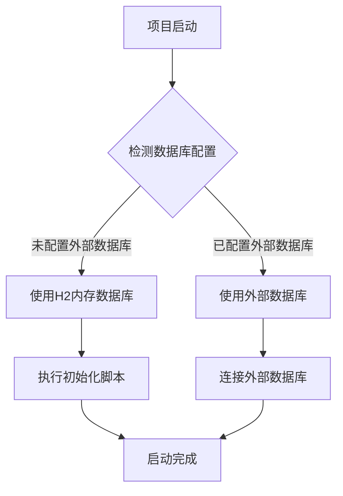

# 为项目添加内存数据库选项

> 需求来源：用户手动描述
> 生成时间：2026-03-30
> 📝 更新记录：已于 2026-03-30 合并澄清答案，共处理 2 条。

## 1. 需求背景与目标

### 1.1 需求背景

当前项目默认使用 PostgreSQL 作为关系数据库，启动时需要依赖外部数据库服务。这给项目的快速启动和体验带来了一定的门槛，用户需要先安装和配置 PostgreSQL 数据库才能正常运行项目。

### 1.2 需求目标

- 为项目添加内存数据库选项（H2 数据库）
- 使项目在默认启动时不依赖外部 MySQL/PostgreSQL 数据库
- 实现项目的快速启动和体验
- 保留对外部数据库的支持，用户可根据需要选择

## 2. 涉及角色

| 角色 | 说明 |
|---|---|
| 开发人员 | 负责实现内存数据库功能 |
| 测试人员 | 负责测试内存数据库模式的功能 |
| 普通用户 | 使用内存数据库模式快速体验项目 |
| 高级用户 | 可选择使用外部数据库 |

## 3. 核心功能列表

| 功能编号 | 功能名称 | 功能描述 | 价值 |
|---|---|---|---|
| 1 | 内存数据库自动配置 | 项目启动时自动配置 H2 内存数据库 | 实现零配置快速启动 |
| 2 | 数据库模式选择 | 支持通过配置选择数据库模式（内存/外部） | 满足不同用户需求 |
| 3 | 数据初始化 | 内存数据库启动时自动初始化基础数据 | 提供完整的体验环境 |
| 4 | 数据源切换 | 实现数据源的无缝切换 | 便于开发和测试 |

## 4. 详细功能描述

### 4.1 内存数据库自动配置

- **触发条件**：项目启动时未配置外部数据库，或明确指定使用内存数据库
- **处理逻辑**：
  1. 自动检测数据库配置
  2. 如未配置外部数据库，自动使用 H2 内存数据库
  3. 配置 H2 数据库的连接参数和初始化脚本
- **预期结果**：项目成功启动，使用 H2 内存数据库

### 4.2 数据库模式选择

- **触发条件**：用户通过配置文件或启动参数指定数据库模式
- **处理逻辑**：
  1. 支持通过 application.yaml 配置 `spring.datasource.type` 属性
  2. 支持通过启动参数 `--spring.datasource.type=H2` 或 `--spring.datasource.type=POSTGRESQL` 指定
  3. 默认使用内存数据库模式
- **预期结果**：项目根据配置使用对应的数据库

### 4.3 数据初始化

- **触发条件**：内存数据库首次启动
- **处理逻辑**：
  1. 自动执行数据库初始化脚本
  2. 创建所有需要的表结构
  3. 插入基础数据（如默认用户、示例数据等）
- **预期结果**：内存数据库包含完整的初始数据

### 4.4 数据源切换

- **触发条件**：用户修改数据库配置并重启项目
- **处理逻辑**：
  1. 项目关闭时正确关闭当前数据源
  2. 启动时根据新配置初始化数据源
  3. 确保数据迁移的平滑性
- **预期结果**：项目使用新配置的数据源正常运行

## 5. 边界与限制

### 5.1 不做什么

- 不实现数据在内存数据库和外部数据库之间的自动同步
- 不实现内存数据库数据的持久化（重启后数据丢失）
- 不替代外部数据库的生产环境用途
- 不提供数据迁移工具

### 5.2 前提假设

- 用户了解内存数据库的特点（数据暂存、重启丢失等）
- 内存数据库主要用于开发、测试和快速体验场景
- 生产环境应使用外部数据库

### 5.3 约束条件

- 内存数据库模式下，数据容量受 JVM 内存限制
- 高并发场景下可能出现性能问题
- 数据安全性较低，不适合存储敏感信息

## 6. 数据结构与字段说明

### 6.1 配置属性

| 字段名 | 类型 | 说明 | 是否必填 | 默认值 |
|---|---|---|---|---|
| spring.datasource.type | String | 数据库类型（H2/POSTGRESQL） | 否 | H2 |
| spring.datasource.url | String | 数据库连接 URL | 否 | 自动生成 |
| spring.datasource.driver-class-name | String | 数据库驱动类 | 否 | 自动选择 |
| spring.datasource.username | String | 数据库用户名 | 否 | sa |
| spring.datasource.password | String | 数据库密码 | 否 | 空 |

### 6.2 初始化数据

| 表名 | 说明 | 关键字段 |
|---|---|---|
| t_user | 用户表 | id, username, password, role |
| t_knowledge_base | 知识库表 | id, name, description |
| t_conversation | 会话表 | id, conversation_id, user_id |
| t_message | 消息表 | id, conversation_id, user_id, content |

## 7. 异常与容错处理

### 7.1 内存数据库启动失败

- **场景**：项目启动时无法初始化内存数据库
- **处理**：
  1. 记录详细错误日志
  2. 提供明确的错误提示
  3. 允许用户选择使用外部数据库

### 7.2 数据初始化失败

- **场景**：内存数据库初始化脚本执行失败
- **处理**：
  1. 回滚已执行的操作
  2. 记录错误信息
  3. 提供修复建议

### 7.3 内存不足

- **场景**：内存数据库数据量过大导致内存不足
- **处理**：
  1. 监控内存使用情况
  2. 提供警告信息
  3. 建议用户使用外部数据库

## 8. 验收标准

### 8.1 功能验收

| 用例编号 | 场景描述 | 操作步骤 | 预期结果 |
|---|---|---|---|
| 1 | 项目快速启动 | 1. 下载项目 <br> 2. 直接启动项目 | 项目在 30 秒内启动成功，无需配置外部数据库 |
| 2 | 数据库模式切换 | 1. 配置使用 PostgreSQL <br> 2. 启动项目 | 项目使用 PostgreSQL 数据库正常运行 |
| 3 | 数据初始化验证 | 1. 启动项目 <br> 2. 检查初始数据 | 数据库包含默认用户和示例数据 |
| 4 | 功能完整性验证 | 1. 使用内存数据库模式 <br> 2. 测试所有功能 | 所有功能正常使用 |

### 8.2 性能验收

| 验收项 | 标准 |
|---|---|
| 启动时间 | ≤ 30 秒 |
| 响应时间 | 页面加载 ≤ 2 秒，API 响应 ≤ 500ms |
| 内存使用 | 稳定运行时 ≤ 512MB |

## 9. ⚠️ 待澄清问题

暂无

## 10. 主流程梳理



## 11. 技术方案

### 11.1 依赖添加

在 `bootstrap` 模块的 `pom.xml` 中添加 H2 数据库依赖：

```xml
<dependency>
    <groupId>com.h2database</groupId>
    <artifactId>h2</artifactId>
    <scope>runtime</scope>
</dependency>
```

### 11.2 配置文件修改

修改 `application.yaml` 文件，添加 H2 数据库配置：

```yaml
spring:
  datasource:
    # 默认使用内存数据库
    type: H2
    # H2 数据库配置
    h2:
      url: jdbc:h2:mem:ragent;DB_CLOSE_DELAY=-1;DB_CLOSE_ON_EXIT=FALSE
      driver-class-name: org.h2.Driver
      username: sa
      password:
    # PostgreSQL 数据库配置
    postgresql:
      url: jdbc:postgresql://localhost:5432/ragent
      driver-class-name: org.postgresql.Driver
      username: postgres
      password: postgres
```

### 11.3 数据源自动配置

创建 `DataSourceConfig` 类，根据配置自动选择数据源：

```java
@Configuration
@ConditionalOnProperty(name = "spring.datasource.type", havingValue = "H2", matchIfMissing = true)
public class H2DataSourceConfig {
    // H2 数据源配置
}

@Configuration
@ConditionalOnProperty(name = "spring.datasource.type", havingValue = "POSTGRESQL")
public class PostgreSQLDataSourceConfig {
    // PostgreSQL 数据源配置
}
```

### 11.4 初始化脚本

创建 H2 数据库的初始化脚本 `schema_h2.sql` 和 `data_h2.sql`，包含所有表结构和基础数据。

## 12. 开发计划

### 12.1 阶段划分

| 阶段 | 时间 | 任务 |
|---|---|---|
| 1 | 第 1-2 天 | 环境搭建和依赖添加 |
| 2 | 第 3-4 天 | 数据源自动配置实现 |
| 3 | 第 5-6 天 | 初始化脚本和数据准备 |
| 4 | 第 7-8 天 | 功能测试和优化 |
| 5 | 第 9-10 天 | 文档编写和最终验证 |

### 12.2 风险评估

| 风险 | 影响 | 应对措施 |
|---|---|---|
| 初始化脚本兼容性 | 数据初始化失败 | 确保初始化脚本兼容 H2 数据库 |
| 功能完整性 | 内存数据库模式功能缺失 | 全面测试内存数据库模式的功能 |
| 性能问题 | 高并发场景性能下降 | 优化内存数据库配置和查询 |

## 13. 总结

本需求旨在为项目添加内存数据库选项，实现项目的快速启动和体验。通过 H2 内存数据库的自动配置和初始化，用户可以在无需安装和配置外部数据库的情况下快速体验项目的所有功能。同时保留对外部数据库的支持，满足不同用户的需求。

内存数据库模式下，数据将存储在内存中，项目重启后数据会丢失，这符合快速体验的设计目标。用户如需持久化数据，可选择使用外部数据库模式。