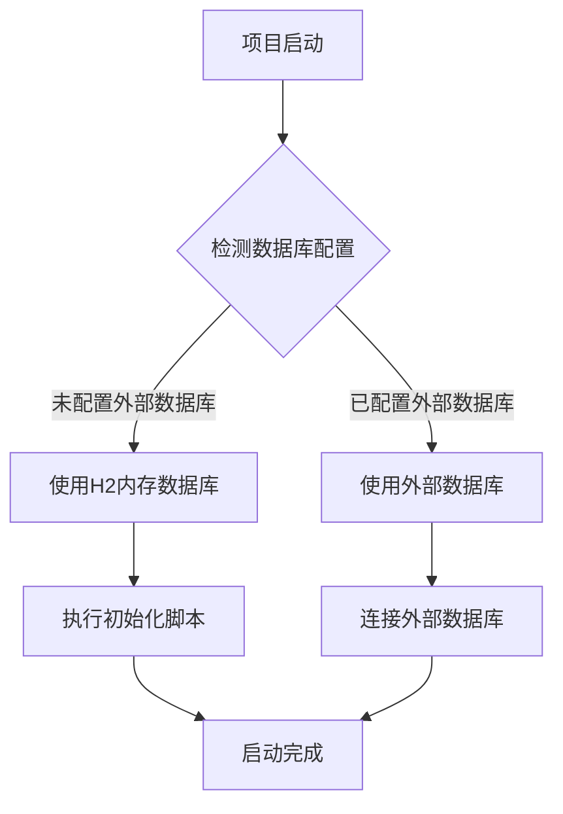
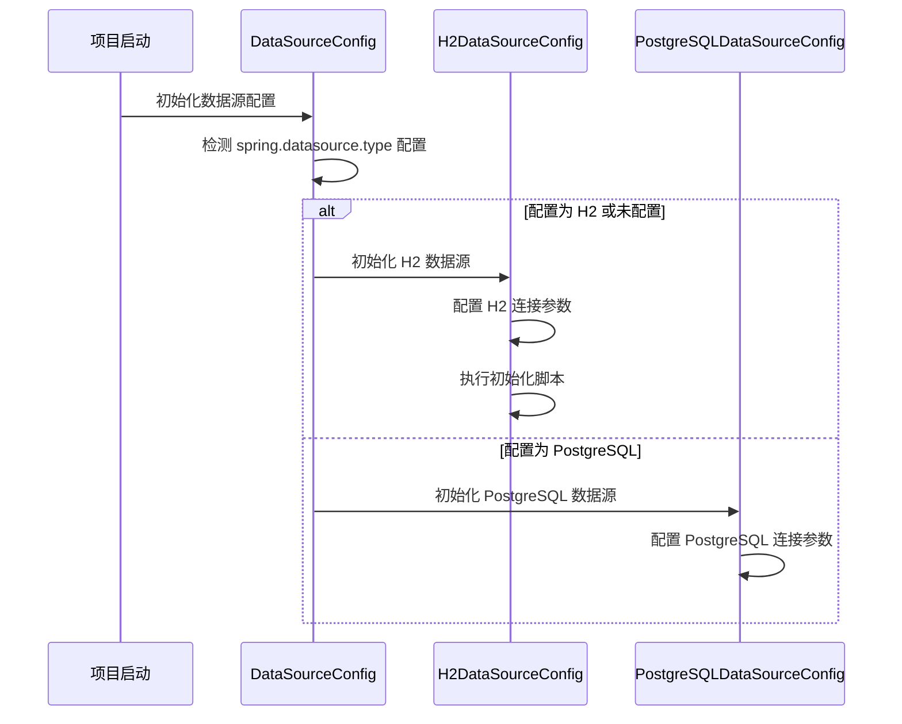
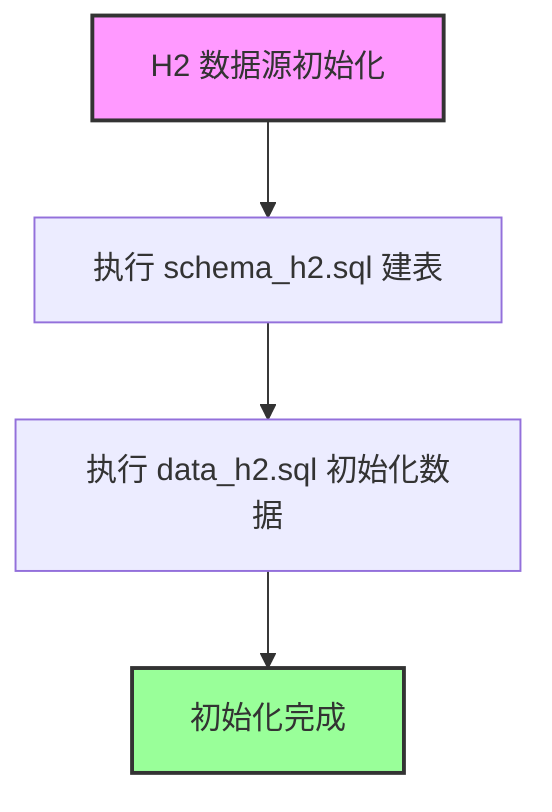
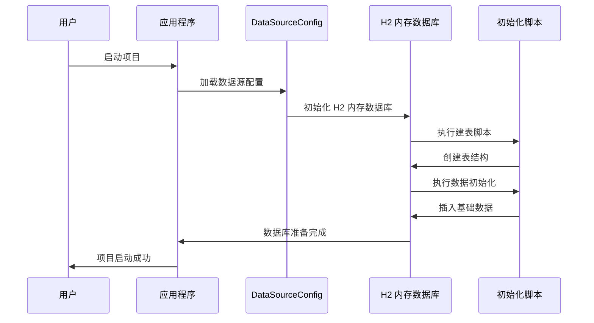
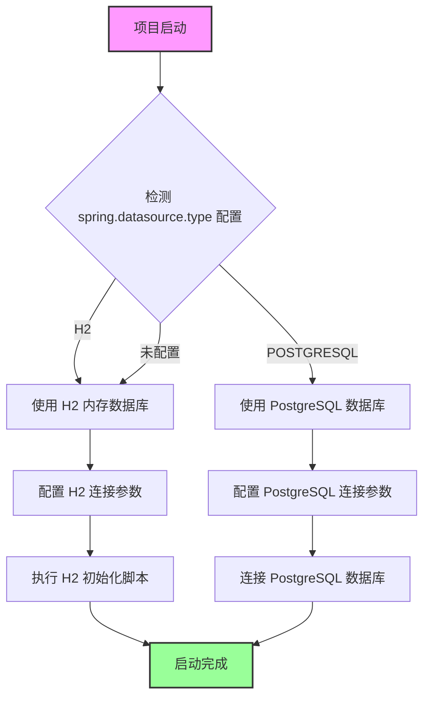

# 为项目添加内存数据库选项 - 程序设计文档

> ⛔ 本文档为设计方案，不含代码实现。确认方案后使用 `/pg:code` 命令开始实施。

## 1. 需求理解与边界确认

### 1.1 需求理解
- **问题**：当前项目默认使用 PostgreSQL 作为关系数据库，启动时需要依赖外部数据库服务，给项目的快速启动和体验带来了门槛。
- **目标**：为项目添加 H2 内存数据库选项，使项目默认启动时不依赖外部数据库，实现快速启动和体验。
- **范围**：
  - 添加 H2 数据库依赖
  - 实现数据源自动配置和切换
  - 提供内存数据库模式的初始化脚本
  - 保留对外部数据库的支持

### 1.2 边界确认
- **不做什么**：
  - 不实现数据在内存数据库和外部数据库之间的自动同步
  - 不实现内存数据库数据的持久化（重启后数据丢失）
  - 不替代外部数据库的生产环境用途
  - 不提供数据迁移工具

## 2. 涉及文件清单

| 操作 | 文件路径 | 说明 |
|---|---|---|
| 修改 | `/bootstrap/pom.xml` | 添加 H2 数据库依赖 |
| 修改 | `/bootstrap/src/main/resources/application.yaml` | 添加 H2 数据库配置 |
| 新增 | `/resources/database/h2/schema_h2.sql` | H2 数据库表结构初始化脚本 |
| 新增 | `/resources/database/h2/data_h2.sql` | H2 数据库基础数据初始化脚本 |
| 新增 | `/bootstrap/src/main/java/com/nageoffer/ai/ragent/config/DataSourceConfig.java` | 数据源自动配置类 |

## 3. 整体架构图

## 4. 数据模型变更

### 4.1 表结构兼容性
H2 数据库将使用与 PostgreSQL 相同的表结构，但需要注意以下兼容性问题：
- 数据类型：H2 支持大多数 PostgreSQL 数据类型，但某些高级类型可能需要调整
- 索引：H2 支持基本索引类型，但全文搜索和空间索引可能需要不同的实现
- 函数和操作符：H2 支持标准 SQL 函数，但 PostgreSQL 特定的函数需要替换

### 4.2 初始化数据
内存数据库启动时将自动初始化以下基础数据：
- 默认用户（admin/123456）
- 示例知识库
- 初始意图树节点
- 示例会话和消息

## 5. API 接口设计

### 5.1 新增接口
无新增 API 接口。所有现有接口在内存数据库模式下保持不变。

### 5.2 接口兼容性
所有现有接口在内存数据库模式下都应该正常工作，包括：
- 用户认证和授权
- 知识库管理
- 会话管理
- RAG 对话接口
- 管理后台接口

## 6. 服务层核心逻辑

### 6.1 数据源自动配置

### 6.2 数据初始化流程

## 7. 时序图

### 7.1 项目启动流程

## 8. 核心流程图

### 8.1 数据库模式选择流程

## 9. Apollo 配置项清单

| 配置键 | 类型 | 默认值 | 说明 | 灰度策略 |
|---|---|---|---|---|
| spring.datasource.type | String | H2 | 数据库类型（H2/POSTGRESQL） | 全量发布 |
| spring.datasource.h2.url | String | jdbc:h2:mem:ragent;DB_CLOSE_DELAY=-1;DB_CLOSE_ON_EXIT=FALSE | H2 数据库连接 URL | 全量发布 |
| spring.datasource.h2.driver-class-name | String | org.h2.Driver | H2 数据库驱动类 | 全量发布 |
| spring.datasource.h2.username | String | sa | H2 数据库用户名 | 全量发布 |
| spring.datasource.h2.password | String | 空 | H2 数据库密码 | 全量发布 |

## 10. 兼容性影响评估

### 10.1 向下兼容性
- 项目默认使用 H2 内存数据库，但保留对 PostgreSQL 的支持
- 已有的 PostgreSQL 配置仍然有效
- 已有的数据迁移脚本仍然适用

### 10.2 数据兼容性
- 内存数据库和外部数据库的数据结构相同
- 但数据存储在不同的位置，相互独立
- 内存数据库的数据在重启后会丢失

### 10.3 功能兼容性
- 所有现有功能在内存数据库模式下都应该正常工作
- 但某些高级功能可能需要调整，如全文搜索

## 11. 风险点与注意事项

### 11.1 风险点

| 风险 | 影响 | 应对措施 |
|---|---|---|
| 内存数据库性能 | 高并发场景下可能出现性能问题 | 优化 H2 数据库配置，建议生产环境使用 PostgreSQL |
| 内存不足 | 数据量过大可能导致内存不足 | 监控内存使用情况，提供警告信息 |
| 数据丢失 | 重启后内存数据库数据会丢失 | 在文档中明确说明，建议重要数据使用外部数据库 |

### 11.2 注意事项

- 内存数据库主要用于开发、测试和快速体验场景
- 生产环境应使用 PostgreSQL 等外部数据库
- 内存数据库模式下，数据容量受 JVM 内存限制
- 数据安全性较低，不适合存储敏感信息

## 12. 扩展性说明

### 12.1 新增数据库类型支持
如果将来需要支持其他数据库类型（如 MySQL、SQLite 等），可以通过以下方式扩展：
1. 在 `DataSourceConfig` 中添加新的数据库配置类
2. 在 `application.yaml` 中添加新的数据库配置
3. 提供相应的初始化脚本
4. 实现相应的方言支持

### 12.2 数据持久化选项
如果将来需要支持内存数据库数据的持久化，可以考虑：
1. 使用 H2 的文件存储模式代替内存模式
2. 添加数据导出和导入功能
3. 实现简单的数据备份和恢复机制