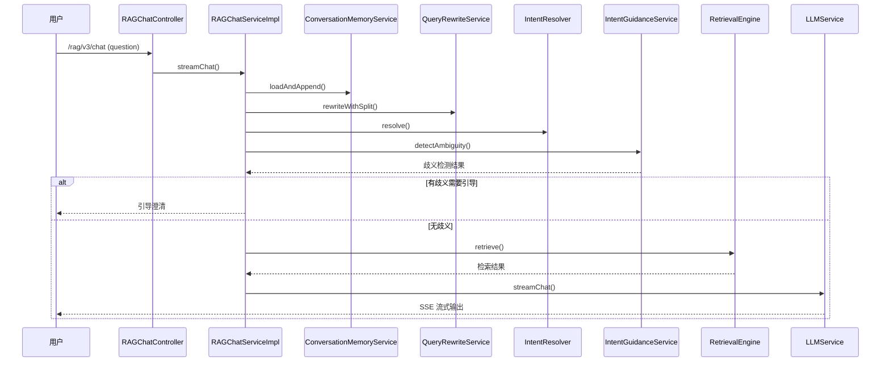
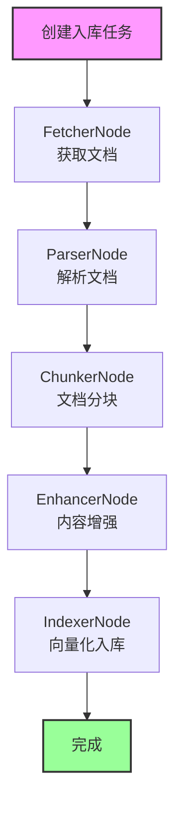

# Ragent AI 现状程序设计文档

> 分析时间：2026-03-30
> 分析范围：
> - 项目根目录结构
> - bootstrap 模块（主业务模块）源代码
> - 项目 pom.xml 配置
> - 核心接口与服务实现
> - 数据库设计（通过代码反向分析）
> 文档用途：本文档作为新需求开发时的「已有系统参考」，供 /pg:plan 使用

---

## 1. 系统概述

Ragent 是一个企业级 RAG（检索增强生成）智能体平台，基于 Java 17 + Spring Boot 3.5.7 + React 18 构建。它覆盖了 RAG 系统从文档入库到智能问答全链路的完整工程实现，包括多路检索、意图识别、问题重写、会话记忆、模型容错、MCP 工具调用、链路追踪等核心能力。

## 2. 技术栈

| 技术 | 版本/说明 |
|---|---|
| 语言 | Java 17 |
| 框架 | Spring Boot 3.5.7 |
| ORM | MyBatis Plus 3.5.14 |
| 向量数据库 | Milvus 2.6.6 |
| 关系数据库 | MySQL + pgvector（向量支持） |
| 文档解析 | Apache Tika 3.2.3 |
| 缓存/限流 | Redis + Redisson 4.0.0 |
| 消息队列 | RocketMQ 5.x |
| 对象存储 | S3 兼容存储（RustFS） |
| 模型供应商 | 百炼（阿里云）、SiliconFlow、Ollama、vLLM |
| 认证鉴权 | Sa-Token 1.43.0 |
| 前端框架 | React 18 + TypeScript + Vite |
| 代码规范 | Spotless 2.22.1（自动格式化） |

## 3. 目录结构概览

```
ragent/
├── bootstrap/             # 业务逻辑层（主模块）
│   ├── src/main/java/com/nageoffer/ai/ragent/
│   │   ├── ragent/        # 核心业务包
│   │   │   ├── RagentApplication.java     # 启动类
│   │   │   ├── rag/       # RAG 核心功能模块
│   │   │   ├── ingestion/ # 文档入库 ETL 流水线
│   │   │   ├── knowledge/ # 知识库管理
│   │   │   ├── admin/     # 管理后台功能
│   │   │   ├── user/      # 用户管理
│   │   │   └── core/      # 核心工具类
│   │   └── resources/     # 配置文件
│   └── pom.xml
├── framework/             # 通用能力层
│   ├── src/main/java/com/nageoffer/ai/ragent/framework/
│   │   ├── context/       # 上下文管理
│   │   ├── convention/    # 约定规范
│   │   ├── exception/     # 异常处理
│   │   ├── trace/         # 链路追踪
│   │   └── web/           # Web 工具
│   └── pom.xml
├── infra-ai/              # AI 基础设施层
│   ├── src/main/java/com/nageoffer/ai/ragent/infra/
│   │   ├── chat/          # LLM 服务抽象
│   │   ├── embedding/     # Embedding 服务
│   │   └── vector/        # 向量存储抽象
│   └── pom.xml
├── mcp-server/            # MCP 服务器（工具调用）
│   ├── src/main/java/com/nageoffer/ai/ragent/mcp/
│   └── pom.xml
├── frontend/              # React 前端
│   ├── src/
│   │   ├── components/    # UI 组件
│   │   ├── pages/         # 页面
│   │   ├── services/      # API 服务
│   │   └── utils/         # 工具
│   └── package.json
├── resources/             # 共享资源
│   ├── database/          # 数据库脚本
│   ├── format/            # 代码格式化配置
│   └── docs/              # 文档
├── pom.xml                # 父项目 Maven 配置
└── README.md              # 项目说明
```

## 4. 核心模块说明

### 4.1 RAG 核心模块（rag 包）

- **职责**：处理用户问答的完整 RAG 链路，包括问题重写、意图识别、检索、生成等核心功能
- **边界**：不负责文档入库、知识库管理等后台功能
- **关键类**：
  - `RAGChatController.java`：对外提供 `/rag/v3/chat` 接口
  - `RAGChatServiceImpl.java`：核心对话服务实现
  - `QueryRewriteService.java`：问题重写与拆分
  - `IntentResolver.java`：意图识别
  - `RetrievalEngine.java`：多路检索引擎
  - `ConversationMemoryService.java`：会话记忆管理
  - `RAGPromptService.java`：Prompt 组装

### 4.2 文档入库模块（ingestion 包）

- **职责**：文档从上传到可检索的完整 ETL 流程，支持多种数据源和处理节点
- **边界**：不负责文档的检索和查询
- **关键类**：
  - `IngestionEngine.java`：入库引擎
  - `IngestionPipelineService.java`：流水线管理
  - `IngestionTaskService.java`：任务管理
  - 各节点实现类：`FetcherNode.java`、`ParserNode.java`、`ChunkerNode.java`、`EnhancerNode.java`、`IndexerNode.java`

### 4.3 知识库模块（knowledge 包）

- **职责**：知识库管理，包括文档、分块、知识库配置等
- **边界**：不负责文档的具体内容处理
- **关键类**：
  - `KnowledgeBaseService.java`：知识库管理
  - `KnowledgeDocumentService.java`：文档管理
  - `KnowledgeChunkService.java`：分块管理

### 4.4 用户管理模块（user 包）

- **职责**：用户认证、授权、信息管理
- **边界**：不负责具体的业务逻辑
- **关键类**：
  - `AuthController.java`：登录/登出接口
  - `UserController.java`：用户信息管理
  - `UserContext.java`：用户上下文

### 4.5 管理后台模块（admin 包）

- **职责**：系统配置、监控、管理功能
- **边界**：不负责用户问答等前端业务
- **关键类**：
  - `DashboardController.java`：仪表板
  - `RAGSettingsController.java`：RAG 配置
  - `RagTraceController.java`：链路追踪

## 5. 主要数据模型

| 表名 | 说明 | 关键字段 |
|---|---|---|
| conversation | 会话表 | id, user_id, title, created_at, updated_at |
| conversation_message | 会话消息表 | id, conversation_id, user_message, ai_message, message_type, created_at |
| knowledge_base | 知识库表 | id, name, description, status, created_at, updated_at |
| knowledge_document | 文档表 | id, kb_id, title, source_url, file_path, status, created_at |
| knowledge_chunk | 文档分块表 | id, doc_id, chunk_content, chunk_index, vector, created_at |
| intent_tree_node | 意图树节点表 | id, parent_id, node_name, node_type, prompt_template, created_at |
| ingestion_task | 入库任务表 | id, pipeline_id, status, total_nodes, current_node, created_at, finished_at |
| ingestion_task_node | 任务节点表 | id, task_id, node_type, node_name, status, input, output, error_msg, created_at |
| user | 用户表 | id, username, password, email, phone, role, created_at |

## 6. 对外接口清单

| 接口路径 | 方法 | 说明 | 是否有历史包袱 |
|---|---|---|---|
| /rag/v3/chat | GET | SSE 流式对话接口 | 否 |
| /rag/v3/stop | POST | 停止对话任务 | 否 |
| /rag/intent-tree | GET | 获取意图树 | 否 |
| /rag/sample-questions | GET | 获取示例问题 | 否 |
| /knowledge/bases | GET | 获取知识库列表 | 否 |
| /knowledge/documents | GET | 获取文档列表 | 否 |
| /ingestion/tasks | GET | 获取入库任务列表 | 否 |
| /ingestion/tasks | POST | 创建入库任务 | 否 |
| /auth/login | POST | 用户登录 | 否 |
| /user/info | GET | 获取用户信息 | 否 |
| /admin/dashboard | GET | 获取仪表板数据 | 否 |
| /admin/settings | GET | 获取系统设置 | 否 |

## 7. 核心业务流程

### 7.1 RAG 对话流程（v3 版本）



### 7.2 文档入库流程



## 8. 术语与命名规范

### 8.1 核心术语

- **RAG**：检索增强生成（Retrieval-Augmented Generation）
- **MCP**：模型上下文协议（Model Context Protocol）
- **ETL**：抽取、转换、加载（Extract, Transform, Load）
- **Embedding**：文本向量化表示
- **Chunk**：文档分块
- **Intent Tree**：意图树（领域→类目→话题的树形分类）

### 8.2 代码命名规范

- **包命名**：`com.nageoffer.ai.ragent.[module].[submodule]`
- **类命名**：大驼峰式，如 `RAGChatServiceImpl`、`ConversationMemoryService`
- **接口命名**：大驼峰式，如 `RAGChatService`、`IntentResolver`
- **方法命名**：小驼峰式，如 `streamChat()`、`loadAndAppend()`
- **变量命名**：小驼峰式，如 `conversationId`、`deepThinking`

## 9. ⚠️ 技术债与历史包袱清单

### 9.1 已知技术债

| 位置 | 问题描述 | 风险等级 | 影响新需求的方式 |
|---|---|---|---|
| 暂无 | 暂无 | 暂无 | 暂无 |

### 9.2 代码质量评估

- **优点**：
  - 分层架构清晰，各模块职责明确
  - 代码规范，使用 Spotless 自动格式化
  - 大量使用设计模式（策略、工厂、装饰器、责任链等）
  - 有完整的测试代码（400+ 源文件）
  - 链路追踪与监控完善
- **潜在改进点**：
  - 部分关键业务逻辑集中在一个类（如 RAGChatServiceImpl 有 197 行）
  - 部分方法参数较多，可考虑使用参数对象

## 10. 新需求开发注意事项

### 10.1 禁止修改的代码

- 框架层代码（framework 模块）：不应随意修改，如需修改应先评估影响
- 基础设施层代码（infra-ai 模块）：模型供应商抽象、向量数据库接口等

### 10.2 必须兼容的逻辑

- 现有的 API 接口：/rag/v3/chat 等接口应保持向后兼容
- 数据库结构：已有的表结构和字段不应随意删除或修改
- 会话管理：conversationId 的生成和管理逻辑

### 10.3 推荐做法

- 遵循现有代码风格和架构模式
- 新增功能应放在合适的包中，如：
  - 对话相关功能：rag 包
  - 文档处理相关功能：ingestion 包
  - 管理功能：admin 包
- 使用 MyBatis Plus 进行数据库操作
- 遵循项目的注释规范（中文注释）
- 为新增功能编写单元测试

### 10.4 开发约束

- 所有交流、思考、任务规划必须使用简体中文
- 代码注释、文档、接口描述必须使用简体中文
- 日志信息、错误提示、操作日志必须使用简体中文
- 数据库字段注释、表注释必须使用简体中文